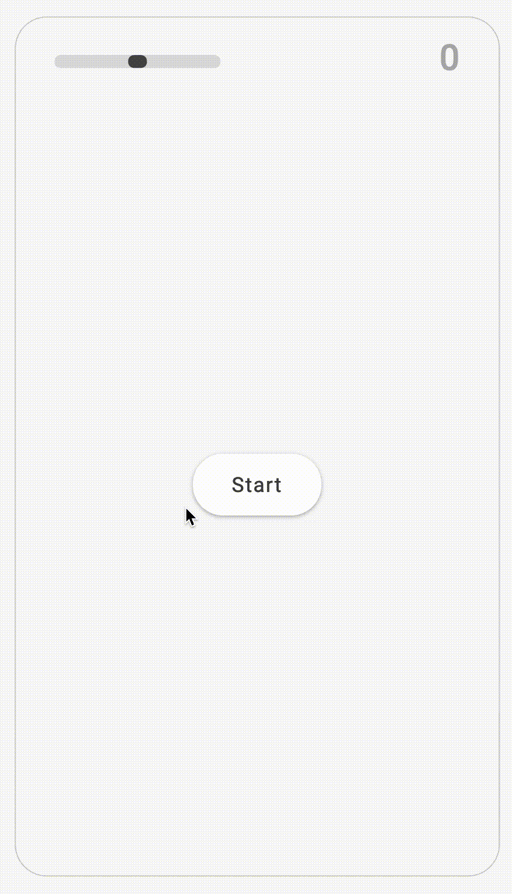
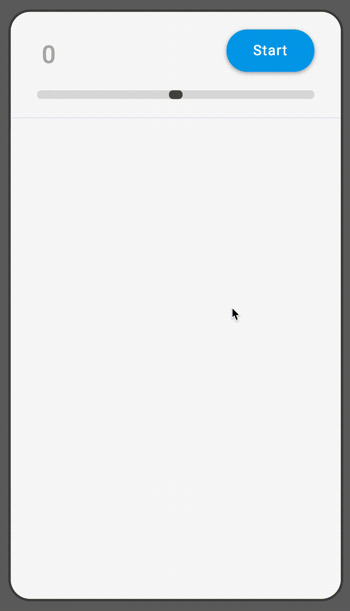

# Ball Game
by David J Merritt, 2019

This game was created in 3 iterations over 2 days.

## v0.1.0
For the first pass I wanted to create the MVP as fast as possible in order to prove out the concept.  The code quality very rough, but the basic design was in place, and all features accounted for.

## Feedback
I then shared the project and got some notes.  I was pretty sure the assignment was complete, but I wanted to be sure. I also wanted to get feedback on other ideas that I thought of implementing for the next iteration.  Since I was pressed for time we flagged each feature with a priority score of 1 to 3.  1 being least important 3 being most important.  We did two passes of the prioritization and then added the results from both rounds.  The features with the highest score were addressed fist. Including:
- Improving the game interactions
- Checking that the speed of the balls dropping matched the requirements.
- Layout tweaks

## v0.2.0
The second pass improved upon the mechanics and design of the first.  The goal being to make the most accurate representation of what was described in the wireframe and instructions as possible, while improving on the design to make it stand out a bit.

### Feedback
The second pass feedback was good. I felt confident that the features were all covered and that the game was engaging, as my wife continued to play even after I didn't require any more feedback.  Always a good sign :)  

## v1.0.0
For the third pass I wanted to focus on features that would make my game stand out. The features I had in mind were not really going to work with original code so I decided to refactor the entire project.  I took inspiration from frameworks I have used on the past and tried to build my own. I wanted to reduce the number of interval loops required to render the game to a single function that would update the entire view.  I also wanted to expand and add a few new features.

### New Features
- Change Layout of Controls
- Add Levels - That exponential increase the speed of balls that are dropped.
- Add More Sound Effects
- Create Title Screen
- Create Game Over Screen
- Add A Goal
- Game Balance

At first I set the goal that if you miss 3 balls the game would be over... but this was a little old hat, so instead opted for a different approach.  I am a fan of 8 and 16-bit RPGs.  So in addition to getting points for collecting balls by clicking on them I also added a life bar that would decrease when any slipped by. Larger balls give you less points but cause more damage and smaller ones, which are harder to click give you more points and cause less damage.  If the user is able to max out the life bar they are rewarded with different sound effect when they click on the balls.  The game is over when the life bar is depleted.  As the player improves they get different end game messages based on the level they were able to reach.  

### Features that didn't make it in :(
- Wind Effects - Blow the balls around the screen at random intervals
- Saved Game
- Leader Board
- Network Interaction - Head-to-head feature that allows 2 players to fight for ball clicks in realtime.
- Mute Button
- Screen Clearing Balls
- Custom Crosshair

## Conclusion
Over all I am pretty happy with the way the game turned out and I had a lot of fun doing it.  The code got a little hackie towards the end as the deadline got closer. v1.0.0 is definitely a better frame for expanding the game in a lot of ways.  As a prototype I think it would serve very well to continue to develop the product based on feedback.  If I were to have to deploy this to a production environment I would spend few more days refining the code a bit for quality assurance.
